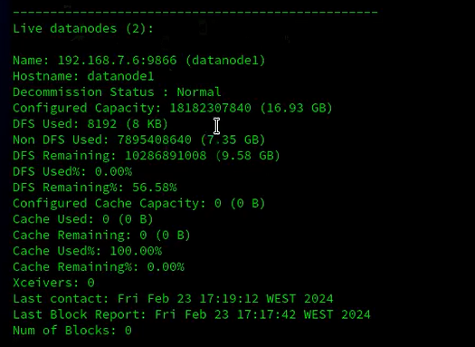

### **Hadoop Cluster Setup**


<hr />

### **Road Map**


### **Prerequisites**
- Java.
- Download a stable version of Hadoop from Apache mirrors.
- red hat linux system or any linux distro.
- Oracle VM VirtualBox


### **Installation**
Installing a Hadoop cluster typically involves unpacking the software on all the machines in the cluster or installing it via a packaging system as appropriate for your operating system. It is important to divide up the hardware into functions.

Typically one machine in the cluster is designated as the NameNode and another machine as the ResourceManager, exclusively. These are the masters. Other services (such as Web App Proxy Server and MapReduce Job History server) are usually run either on dedicated hardware or on shared infrastructure, depending upon the load.

The rest of the machines in the cluster act as both DataNode and NodeManager. These are the workers.


## **`Networking`**
### **`Oracle VM VirtualBox`**
Tools > Preferences ( icon ) > Network, and then double-click the appropriate NAT Network.

1. Select the NAT network option in VirtualBox.
2. Create a new NAT network if one doesn't exist already.
3. Configure the network with the following example IP address: `192.168.7.0`.
4. Enable DHCP for the network.
5. Click on "Apply" to save the changes.


### **`redhad:`**

First, make sure you have installed Vim on your system. For example, in Red Hat :
```bash
sudo dnf search vim
```

- Use the command `ifconfig` in the terminal for each VM to obtain the IP address.

- Open the hosts file using the command below.

```bash
sudo vi hosts
```
- Verify that these IP addresses are correct.
- Put these IP addresses in the `hosts` file as listed below.
```bash
192.168.7.4 namenode1
192.168.7.6 datanode1
192.168.7.7 datanode2
```

Once you have completed these steps, proceed to the next step by configuring the hostname file. To do so, open the file located at /etc/hostname:

```bash
sudo vi /etc/hostname 
```

Then, add the specified hostname, for example, `namenode1`:

```bash
namenode1 # Ensure that if 'localhost' or any other entry is present in the file, remove it and replace it with 'the specified hostname'.
```


## **`Configuring Hadoop in Non-Secure Mode`**
Hadoop’s Java configuration is driven by two types of important configuration files:

- Read-only default configuration - core-default.xml, hdfs-default.xml, yarn-default.xml and mapred-default.xml.

- Site-specific configuration - etc/hadoop/core-site.xml, etc/hadoop/hdfs-site.xml, etc/hadoop/yarn-site.xml and etc/hadoop/mapred-site.xml.

To configure the Hadoop cluster you will need to configure the environment in which the Hadoop daemons execute as well as the configuration parameters for the Hadoop daemons.

### **`Configure The Environment`:**

```bash
sudo vi ~/.bashrc
```
Then add these arguments to the .bashrc file.
```bash
# java
export JAVA_HOME=/usr/lib/jvm/java-1.8.0-openjdk
export PATH=$JAVA_HOME/bin:$PATH
# hadoop
export HADOOP_HOME=/home/jane/hadoop
export HADOOP_INSTALL=$HADOOP_HOME
export HADOOP_MAPRED_HOME=$HADOOP_HOME
export HADOOP_COMMON_HOME=$HADOOP_HOME
export HADOOP_CONF_DIR=${HADOOP_HOME}/etc/hadoop
export HADOOP_HDFS_HOME=$HADOOP_HOME
export YARN_HOME=$HADOOP_HOME
export HADOOP_COMMON_LIB_NATIVE_DIR=$HADOOP_HOME/lib/native
export PATH=$PATH:$HADOOP_HOME/sbin:$HADOOP_HOME/bin
export HADOOP_OPTS=-Djava.net.preferIOv4stack=true
export HADOOP_OPTS="-Djava.library.path=$HADOOP_HOME/lib/native"
```


HDFS daemons are NameNode, SecondaryNameNode, and DataNode. YARN daemons are ResourceManager, NodeManager, and WebAppProxy. If MapReduce is to be used, then the MapReduce Job History Server will also be running. For large installations, these are generally running on separate hosts.


## **`config ssh:`**
SSH passwordless login is an SSH authentication method that employs a pair of public and private keys for asymmetric encryption. The public key resides on the server, and only a client that presents the 
private key can connect.

to setup ssh you need only to run commands bellow:
- Generate an RSA SSH key using: ssh-keygen -t rsa:
```bash
ssh-keygen -t rsa
```
- Append the contents of the `id_rsa.pub` file to the `authorized_keys` file using:
```bash
cat id_rsa.pub >> authorized_keys
```


- Use `ssh-copy-id` to copy your `SSH` public key to the `authorized_keys` file on the remote machine:
```bash
ssh-copy-id username@slave_ip
```
- To SSH into a machine with the IP address 'ip' or the hostname 'hostname' with the username 'username', you can use the following command let's try login :

```bash
ssh username@ip
# example: ssh 'jane@192.168.7.6'
```


### **`Configuring Environment of Hadoop Daemons`**

Administrators should use the etc/hadoop/hadoop-env.sh and optionally the etc/hadoop/mapred-env.sh and etc/hadoop/yarn-env.sh scripts to do site-specific customization of the Hadoop daemons’ process environment.

At the very least, you must specify the JAVA_HOME so that it is correctly defined on each remote node.

Administrators can configure individual daemons using the configuration options shown below in the table:

for etc/hadoop/hadoop-env.sh :
```bash
export JAVA_HOME=/usr/lib/jvm/java-1.8.0-openjdk
#allow a specific user to run the 
export HDFS_NAMENODE_USER="jane"
export HDFS_DATANODE_USER="jane"
export YARN_RESOURCEMANAGER_USER="jane"
export HDFS_SECONDARYNAMENODE_USER="jane"
```

### **`Configuring the Hadoop Daemons:`**

This section deals with important parameters to be specified in the given configuration files:

etc/hadoop/core-site.xml.
<table>
    <tr>
        <th>Parameter</th>
        <th>Value</th>
        <th>Notes</th>
    </tr>
    <tr>
        <td>fs.defaultFS</td>
        <td>NameNode URI</td>
        <td><i style="color:skyblue">hdfs://host:port/</i></td>
    </tr>
    <tr>
        <td>io.file.buffer.size</td>
        <td>131072</td>
        <td><i>Size of read/write buffer used in SequenceFiles.</i></td>
    </tr>
<table>


now let's apply this config in our hadoop core-site.xml file:

first open the file
```bash
sudo vi ~/hadoop/etc/hadoop/core-site.xml
```

Then add these configurations to the etc/hadoop/core-site.xml file.

```xml
<configuration>
    <property>
        <name>fs.defaultFS</name>
        <value>hdfs://namenode1:9000</value>
    </property>
</configuration>
```


The `hdfs-site.xml` file in Hadoop is a core configuration file used to specify various settings related to the Hadoop Distributed File System (HDFS). It contains parameters that govern the behavior of HDFS daemons such as the NameNode, DataNode, and Secondary NameNode. The settings defined in this file are typically related to HDFS-specific configurations such as block size, replication factor, storage directories, and other properties essential for the functioning of the distributed file system.

### **`Configurations for NameNode:`**
etc/hadoop/hdfs-site.xml
```xml
<configuration>
    <property>
        <name>dfs.namenode.name.dir</name>
        <value>~/hdfs/namenode</value>
    </property>
    <property>
        <name>dfs.replication</name>
        <value>3</value>
    </property>
</configuration>
```
Additional configuration

<table>
    <tr>
        <th>Parameter</th>
        <th>Value</th>
        <th>Notes</th>
    </tr>
    <tr>
        <td>dfs.namenode.name.dir</td>
        <td>Path on the local filesystem where the NameNode stores the namespace and transactions logs persistently.</td>
        <td><i> transactions logs persistently.	If this is a comma-delimited list of directories then the name table is replicated in all of the directories, for redundancy.</i></td>
    </tr>
    <tr>
        <td>dfs.hosts / dfs.hosts.exclude</td>
        <td>List of permitted/excluded DataNodes</td>
        <td><i>If necessary, use these files to control the list of allowable datanodes.</i></td>
    </tr>
    <tr>
        <td>dfs.blocksize</td>
        <td>268435456</td>
        <td><i>HDFS blocksize of 256MB for large file-systems.</i></td>
    </tr>
    <tr>
        <td>dfs.namenode.handler.count</td>
        <td>100</td>
        <td><i>More NameNode server threads to handle RPCs from large number of DataNodes.</i></td>
    </tr>
<table>

If you need more information or want to understand these configurations better, please refer to [more config](https://hadoop.apache.org/docs/r2.4.1/hadoop-project-dist/hadoop-hdfs/hdfs-default.xml).


### **`Configurations for DataNode:`**

<table>
    <tr>
        <th>Parameter</th>
        <th>Value</th>
        <th>Notes</th>
    </tr>
    <tr>
        <td>dfs.datanode.data.dir</td>
        <td>Comma separated list of paths on the local filesystem of a DataNode where it should store its blocks.</td>
        <td><i>If this is a comma-delimited list of directories, then data will be stored in all named directories, typically on different devices.</i></td>
    </tr>
<table>

- open etc/hadoop/hdfs-site.xml using :
```bash
sudo vim ~/hadoop/etc/hadoop/hdfs-site.xml
# Note: 
# ~ => /home/username 
# example => /home/jane/hadoop/etc/hadoop/hdfs-site.xml
# jane (essadi) => username
```
Then add these configurations to the etc/hadoop/hdfs-site.xml file.
```xml
<configuration>
    <property>
        <name>dfs.datanode.data.dir</name>
        <value>~/hdfs/datanode</value>
    </property>
</configuration>
```


```bash
sudo vi ~/hadoop/etc/hadoop/yarn-site.xml
```

Configurations for ResourceManager and NodeManager:
```xml
<configuration>
    <property>
        <name>yarn.resourcemanager.hostname</name>
        <value>namenode1</value>
    </property>
    <property>
        <name>yarn.nodemanager.aux-services</name>
        <value>mapreduce_shuffle</value>
    </property>
    <property>
        <name>yarn.nodemanager.aux-services.mapreduce.class</name>
        <value>org.hadoop.mapred.shufflehandler</value>
    </property>
    <property>
        <name>yarn.resourcemanager.webapp.address</name>
        <value>namenode1:8088</value>
    </property>
    <property>
        <name>yarn.resourcemanager.resource-tracker.address</name>
        <value>namenode1:8031</value>
    </property>
</configuration>
```

### **` Workers File:`**
List all worker hostnames or IP addresses in your etc/hadoop/workers file, one per line. Helper scripts (described below) will use the etc/hadoop/workers file to run commands on many hosts at once. It is not used for any of the Java-based Hadoop configuration. In order to use this functionality, ssh trusts (via either passphraseless ssh or some other means, such as Kerberos) must be established for the accounts used to run Hadoop.
```bash
sudo vi ~/hadoop/etc/hadoop/workers
```
The Hadoop workers file, typically named workers, is a configuration file used in a Hadoop cluster setup to specify the hostnames or IP addresses of machines that will act as worker nodes. Each line in this file represents a single worker node.
```bash
datanode1
datanode2
```

## **`Operating the Hadoop Cluster:`**

Once all the necessary configuration is complete, distribute the files to the `HADOOP_CONF_DIR` directory on all the machines. This should be the same directory on all machines.

In general, it is recommended that HDFS and YARN run as separate users. In the majority of installations, HDFS processes execute as ‘hdfs’. YARN is typically using the ‘yarn’ account.

### **`Hadoop Startup:`**
To start a Hadoop cluster you will need to start both the HDFS and YARN cluster.

The first time you bring up HDFS, it must be formatted. Format a new distributed filesystem as hdfs:

```bash
hdfs namenode -format
```

all of the HDFS processes can be started with a utility script. As hdfs:

```bash
start-dfs.sh
```

all of the YARN processes can be started with a utility script. As yarn:

```bash
start-yarn.sh
```

To check if the node is running successfully, use the command below.
```bash
hdfs dfsadmin -report
```

The result must be like this:


If the data nodes do not appear, please check the ports. An easier solution is  to disable firewalld `sudo systemctl disable firewalld`, which I do not recommend. Instead, we can selectively allow ports to facilitate connections between nodes.

To check the ports for the datanode, go to the terminal and type 
```bash
netstat -tunl | grep LISTEN
```
Look for the port 9866. To open this port in Red Hat, you can use the following command:

```bash
sudo firewall-cmd --zone=public --add-port=9866/tcp --permanent
```
This command adds port 9866 for TCP traffic in the firewall settings permanently. After executing this command, remember to reload the firewall settings for changes to take effect:
```bash
sudo firewall-cmd --reload
```
After adding the ports permanently, now restart your Hadoop by running the command below:
```bash
start-dfs.sh
```


## **`MapReduce:`**

MapReduce is a programming model for processing and generating large datasets in parallel across a distributed cluster of computers. A common example is the word count problem, where you want to count the frequency of each word in a large collection of documents.

Now let's run the code by copying the Python scripts from the MapReduce folder. Next, create a text file and name it as desired, such as 
'index.txt'.
```bash
cd ~/Desktop
touch index.txt
```
add some content to your file any content Then, upload the file to HDFS using the command below
```bash
#for create a folder
hdfs dfs -mkdir /user
#now put the text folder 
hdfs dfs -put index.txt /user/index.txt
#for check the file if exists in hdfs run the command bellow
hdfs dfs -ls /user
```
and execute the MapReduce program using the command:
```bash
#make sure you replace ... with the correct path
hadoop jar ~/hadoop/share/.../lib/hadoop-streaming-v-x.jar
-input /user/index.txt
-output /users/output
-mapper mapper.py
-reducer reducer.py
```

